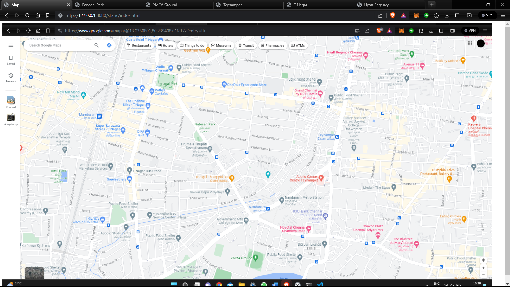
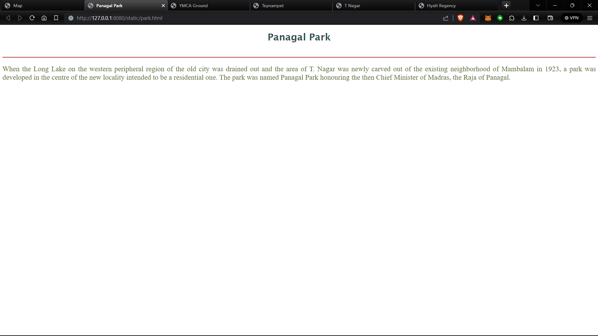
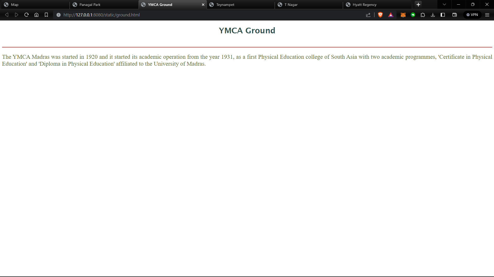
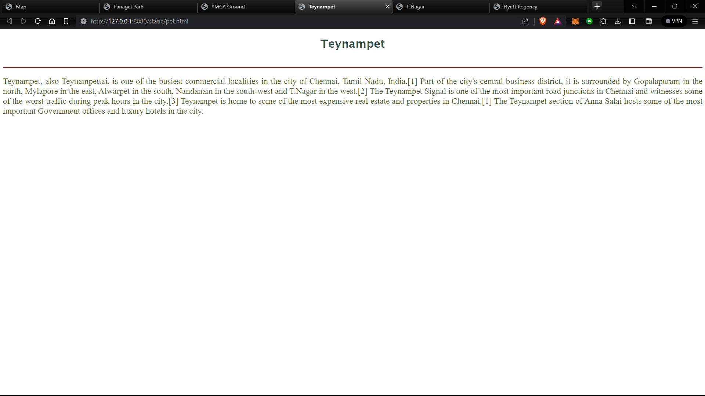
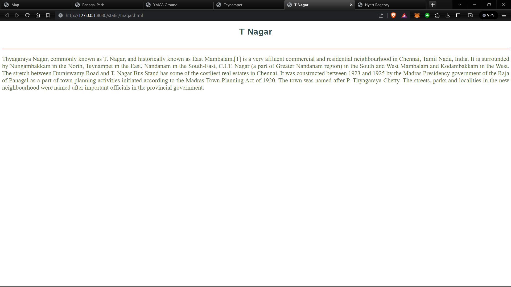
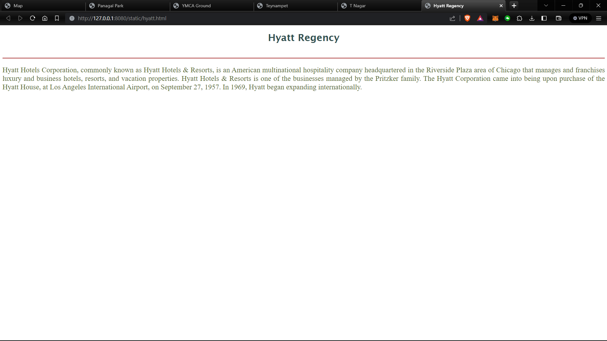
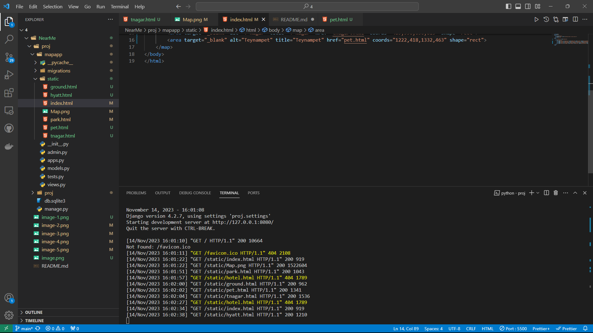

# Ex04 Places Around Me

Date : 15-10-2023

## AIM
To develop a website to display details about the places around my house.

## DESIGN STEPS

### STEP 1
Create a Django admin interface.

### STEP 2
Download your city map from Google.

### STEP 3
Using ```<map>``` tag name the map.

### STEP 4
Create clickable regions in the image using ```<area>``` tag.

### STEP 5
Write HTML programs for all the regions identified.

### STEP 6
Execute the programs and publish them.

## CODE

```html
<!DOCTYPE html>
<html lang="en">
<head>
    <meta charset="UTF-8">
    <meta name="viewport" content="width=device-width, initial-scale=1.0">
    <title>Map</title>
</head>
<body>
    

    <map name="image-map">
        <area target="_blank" alt="Panagal Park" title="Panagal Park" href="park.html" coords="601,182,686,268" shape="rect">
        <area target="_blank" alt="YMCA Ground" title="YMCA Ground" href="ground.html" coords="957,889,1024,968" shape="rect">
        <area target="_blank" alt="Hyatt Regency" title="Hyatt Regency" href="hyatt.html" coords="1293,113,1479,157" shape="rect">
        <area target="_blank" alt="T Nagar" title="T Nagar" href="tnagar.html" coords="489,556,650,619" shape="rect">
        <area target="_blank" alt="Teynampet" title="Teynampet" href="pet.html" coords="1222,418,1332,463" shape="rect">
    </map>
</body>
</html>
```

```html
<!DOCTYPE html>
<html lang="en">
<head>
    <meta charset="UTF-8">
    <meta name="viewport" content="width=device-width, initial-scale=1.0">
    <title>T Nagar</title>
    <style>
        h1{
            text-align: center;
            font-family: 'Lucida Sans', 'Lucida Sans Regular', 'Lucida Grande', 'Lucida Sans Unicode', Geneva, Verdana, sans-serif;
            color:darkslategray;
        }
        p{
            text-align: justify;
            color:darkolivegreen;
            font-size: x-large;
            
        }
    </style>
</head>
<body>
    <h1>T Nagar</h1>
    <br>
    <hr color="Brown">
    <p>Thyagaraya Nagar, commonly known as T. Nagar, and historically known as East Mambalam,[1] is a very affluent commercial and residential neighbourhood in Chennai, Tamil Nadu, India. It is surrounded by Nungambakkam in the North, Teynampet in the East, Nandanam in the South-East, C.I.T. Nagar (a part of Greater Nandanam region) in the South and West Mambalam and Kodambakkam in the West. The stretch between Duraiswamy Road and T. Nagar Bus Stand has some of the costliest real estates in Chennai. It was constructed between 1923 and 1925 by the Madras Presidency government of the Raja of Panagal as a part of town planning activities initiated according to the Madras Town Planning Act of 1920. The town was named after P. Thyagaraya Chetty. The streets, parks and localities in the new neighbourhood were named after important officials in the provincial government.</p>
</body>
</html>
```

```html
<!DOCTYPE html>
<html lang="en">
<head>
    <meta charset="UTF-8">
    <meta name="viewport" content="width=device-width, initial-scale=1.0">
    <title>Panagal Park</title>
    <style>
        h1{
            text-align: center;
            font-family: 'Lucida Sans', 'Lucida Sans Regular', 'Lucida Grande', 'Lucida Sans Unicode', Geneva, Verdana, sans-serif;
            color:darkslategray;
        }
        p{
            text-align: justify;
            color:darkolivegreen;
            font-size: x-large;
            
        }
    </style>
</head>
<body>
    <h1>Panagal Park</h1>
    <br>
    <hr color="Brown">
    <p>When the Long Lake on the western peripheral region of the old city was drained out and the area of T. Nagar was newly carved out of the existing neighborhood of Mambalam in 1923, a park was developed in the centre of the new locality intended to be a residential one. The park was named Panagal Park honouring the then Chief Minister of Madras, the Raja of Panagal.</p>
</body>
</html>
```

```html
<!DOCTYPE html>
<html lang="en">
<head>
    <meta charset="UTF-8">
    <meta name="viewport" content="width=device-width, initial-scale=1.0">
    <title>Hyatt Regency</title>
    <style>
        h1{
            text-align: center;
            font-family: 'Lucida Sans', 'Lucida Sans Regular', 'Lucida Grande', 'Lucida Sans Unicode', Geneva, Verdana, sans-serif;
            color:darkslategray;
        }
        p{
            text-align: justify;
            color:darkolivegreen;
            font-size: x-large;
            
        }
    </style>
</head>
<body>
    <h1>Hyatt Regency</h1>
    <br>
    <hr color="Brown">
    <p>Hyatt Hotels Corporation, commonly known as Hyatt Hotels & Resorts, is an American multinational hospitality company headquartered in the Riverside Plaza area of Chicago that manages and franchises luxury and business hotels, resorts, and vacation properties. Hyatt Hotels & Resorts is one of the businesses managed by the Pritzker family.

        The Hyatt Corporation came into being upon purchase of the Hyatt House, at Los Angeles International Airport, on September 27, 1957. In 1969, Hyatt began expanding internationally.</p>
</body>
</html>
```

```html
<!DOCTYPE html>
<html lang="en">
<head>
    <meta charset="UTF-8">
    <meta name="viewport" content="width=device-width, initial-scale=1.0">
    <title>YMCA Ground</title>
    <style>
        h1{
            text-align: center;
            font-family: 'Lucida Sans', 'Lucida Sans Regular', 'Lucida Grande', 'Lucida Sans Unicode', Geneva, Verdana, sans-serif;
            color:darkslategray;
        }
        p{
            text-align: justify;
            color:darkolivegreen;
            font-size: x-large;
            
        }
    </style>
</head>
<body>
    <h1>YMCA Ground</h1>
    <br>
    <hr color="Brown">
    <p>The YMCA Madras was started in 1920 and it started its academic operation from the year 1931, as a first Physical Education college of South Asia with two academic programmes, 'Certificate in Physical Education' and 'Diploma in Physical Education' affiliated to the University of Madras.</p>
</body>
</html>
```

```html
<!DOCTYPE html>
<html lang="en">
<head>
    <meta charset="UTF-8">
    <meta name="viewport" content="width=device-width, initial-scale=1.0">
    <title>Teynampet</title>
    <style>
        h1{
            text-align: center;
            font-family: 'Lucida Sans', 'Lucida Sans Regular', 'Lucida Grande', 'Lucida Sans Unicode', Geneva, Verdana, sans-serif;
            color:darkslategray;
        }
        p{
            text-align: justify;
            color:darkolivegreen;
            font-size: x-large;
            
        }
    </style>
</head>
<body>
    <h1>Teynampet</h1>
    <br>
    <hr color="Brown">
    <p>Teynampet, also Teynampettai, is one of the busiest commercial localities in the city of Chennai, Tamil Nadu, India.[1] Part of the city's central business district, it is surrounded by Gopalapuram in the north, Mylapore in the east, Alwarpet in the south, Nandanam in the south-west and T.Nagar in the west.[2] The Teynampet Signal is one of the most important road junctions in Chennai and witnesses some of the worst traffic during peak hours in the city.[3] Teynampet is home to some of the most expensive real estate and properties in Chennai.[1] The Teynampet section of Anna Salai hosts some of the most important Government offices and luxury hotels in the city.</p>
</body>
</html>
```

## OUTPUT








## RESULT
The program for implementing image maps using HTML is executed successfully.
